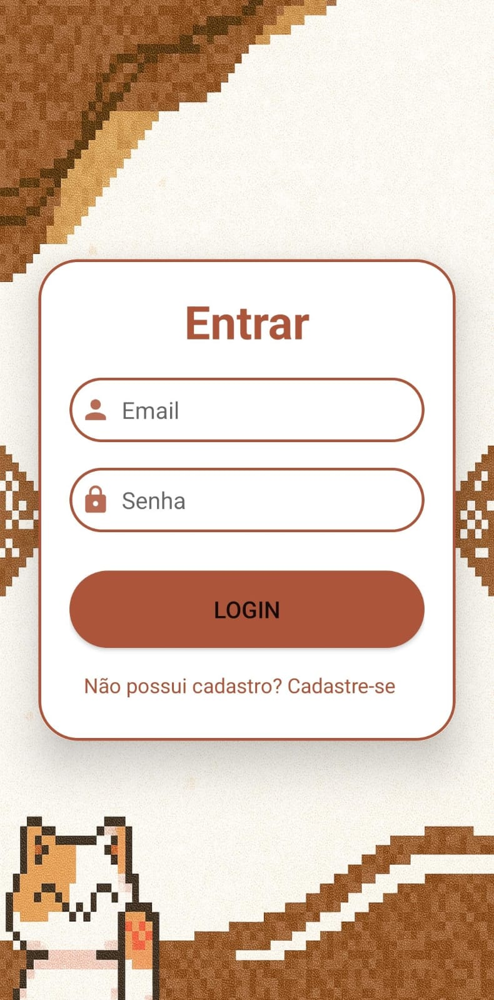
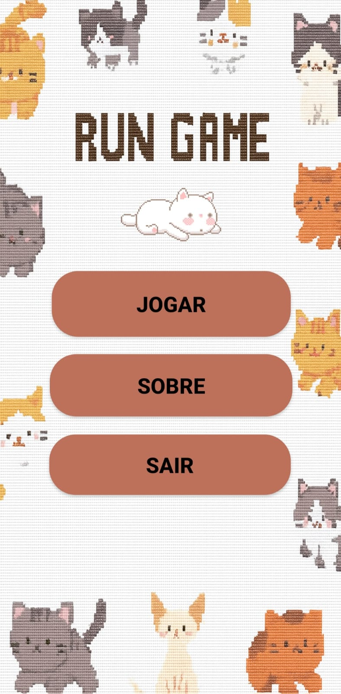
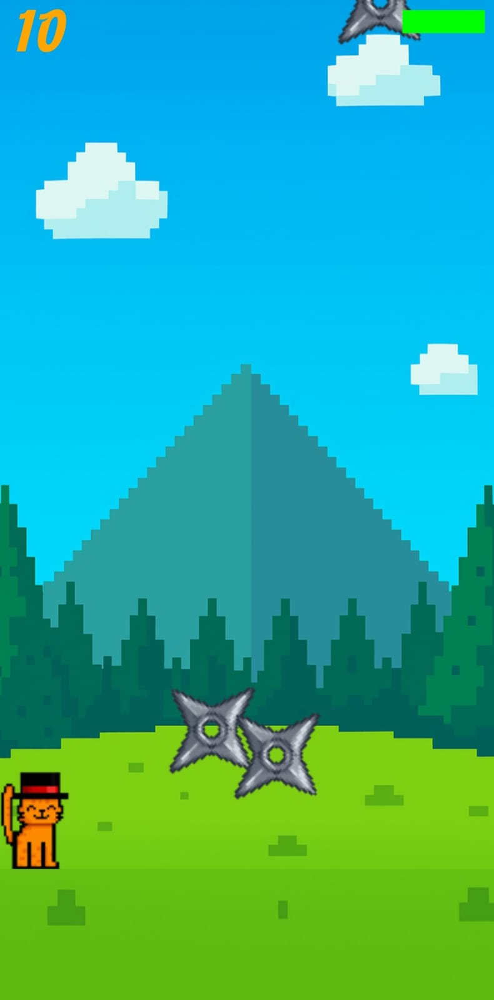
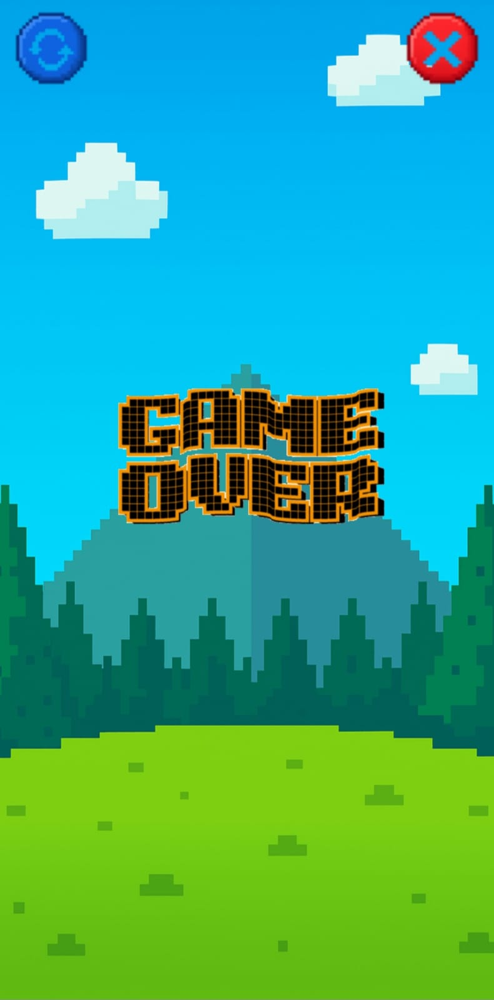

# 🐱 Run Game

> **Nota:** Este jogo foi desenvolvido como parte de uma disciplina acadêmica, com objetivo de nota. Para mim, o foco principal foi **aprender e adquirir conhecimento** no desenvolvimento de jogos mobile.

Um jogo mobile desenvolvido em **Java + XML** no **Android Studio**, onde você controla um gatinho que precisa fugir de obstáculos e sobreviver o maior tempo possível!

O projeto também está integrado com o **Firebase**, permitindo autenticação de usuários (login e cadastro) e armazenamento de informações.

## 🎮 Sobre o jogo

No **Run Game**, você controla um **gatinho** que deve escapar de **shurikens**.  
- Caso o personagem seja atingido pelos obstáculos, ele perde vida.  
- Quando a vida chega a **zero**, o jogo termina.  
- Existe um **sistema de pontuação** para desafiar os jogadores a superarem seus próprios recordes.  

## ✨ Funcionalidades

- **Sistema de autenticação Firebase**  
  - Login e cadastro de usuários.  
  - Dados salvos diretamente na nuvem.  

- **Jogabilidade dinâmica**  
  - Controle do personagem em tempo real.  
  - Colisão com obstáculos que causam dano.  
  - Fim de jogo quando a vida acaba.  

- **Sistema de pontuação**  
  - Pontos acumulados conforme o jogador sobrevive.  
  - Possibilidade de implementar ranking no futuro.

- **Design e Arte**
  - Grande parte das telas, elementos visuais e sprites do jogo foram feitos **à mão**, no estilo **pixel art**.  
  - Todo o design foi pensado para dar uma estética divertida ao jogo.  
  - A integração da arte com o jogo foi feita diretamente no **Android Studio**, usando **XML** para organizar os componentes e estruturar as telas.  

- **Áudio integrado**  
  - Sons de colisão e efeitos.  
  - Trilha sonora durante o jogo.  

## 🛠️ Tecnologias utilizadas

- **Linguagem:** Java ☕  
- **Interface gráfica:** XML 🎨  
- **IDE:** Android Studio 💻  
- **Banco de dados & Autenticação:** Firebase 🔥  

## 🚀 Como rodar o projeto

1. Clone este repositório:  
   ```bash
   git clone https://github.com/SEU-USUARIO/run-game.git
   ```
2. Abra o projeto no Android Studio.
3. Configure o Firebase (adicione o **google-services.json** na pasta **app/**).
4. Execute o projeto em um emulador ou dispositivo Android físico.

## 📷 Screenshots

| Tela de Login | Tela de Menu | Gameplay | Game Over |
|---------------|--------------|----------|-----------|
|  |  |  |  |

## 📌 Próximos passos (possíveis melhorias)
- Adicionar ranking global de jogadores.
- Inserir novos obstáculos e power-ups.
- Melhorar animações do personagem.
- Adicionar sons e trilha sonora.

## 📄 Licença
Este projeto foi desenvolvido por **Beatriz Christine Azevedo Batista**  
e está licenciado sob a **Licença MIT** — veja o arquivo [LICENSE](LICENSE) para mais detalhes.

